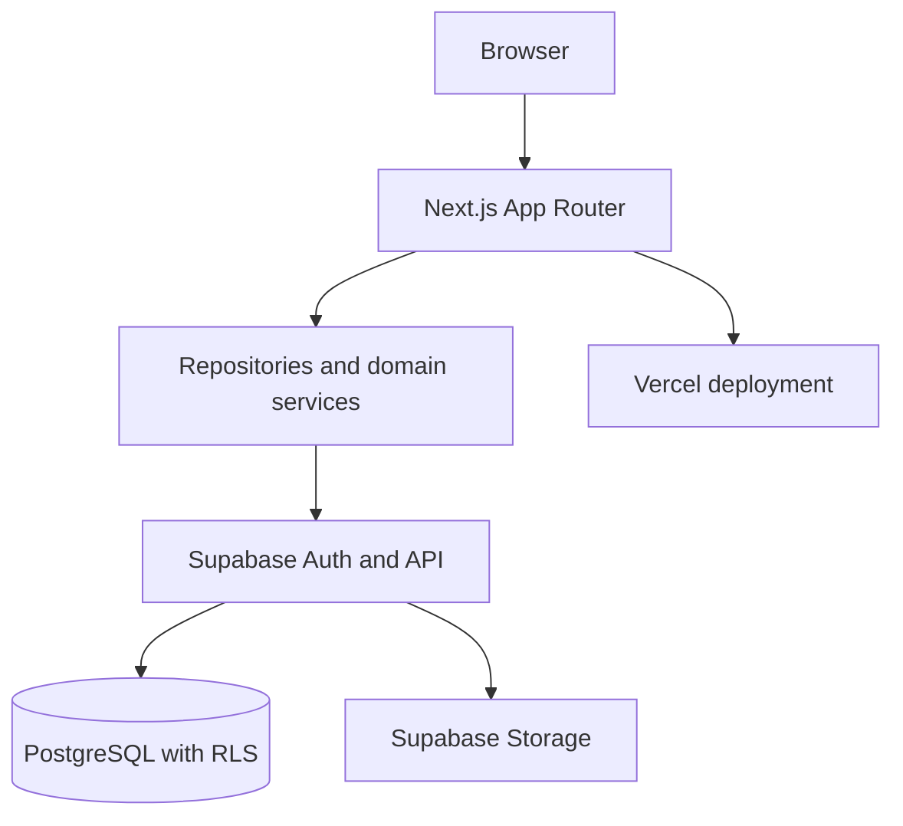
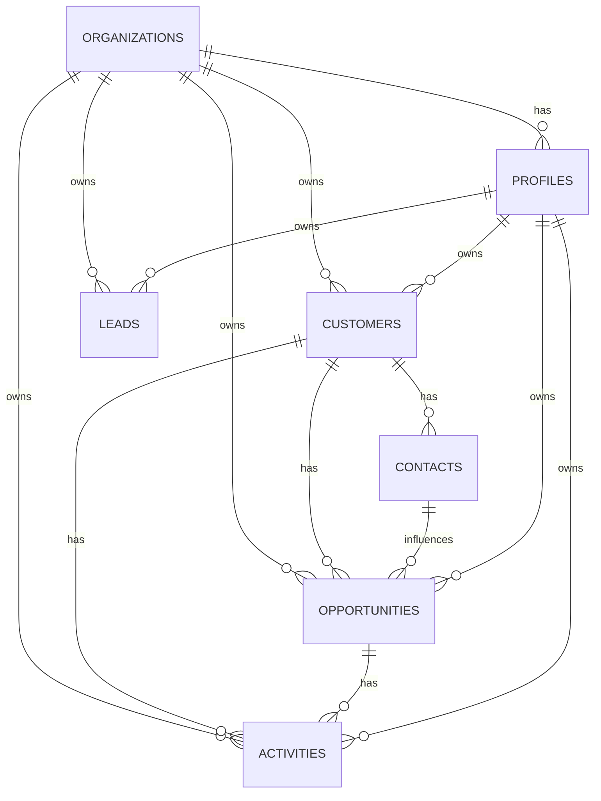

# Architecture

## Status

This document describes the Phase 0 foundation, the implemented authentication shell, and the intended V1 boundaries. CRM data screens and repositories remain planned.

## Goals

- Give Norwegian B2B sales teams a focused daily workspace.
- Keep domain rules independent from UI and vendor integrations.
- Enforce organization boundaries in PostgreSQL, not only in browser code.
- Leave room for products, quotes, orders, integrations, and advisory AI.

## System overview

The browser will use server components and server actions where practical. Database access will be centralized in `src/lib/data-access`; business calculations will live in `src/lib/domain`.

## Frontend architecture

- `src/app`: routes, layouts, loading, error, and not-found boundaries.
- `src/components`: reusable UI and feature components.
- `src/lib/domain`: pure calculations and lifecycle rules.
- `src/lib/data-access`: Supabase clients, repositories, and query DTOs.
- UI labels are Norwegian in V1; code and database identifiers remain English. A later localization layer should keep labels out of domain code.
- `/login` provides password authentication, `/auth/callback` supports exchanged auth codes, and `/dashboard` is protected by both the proxy and server layout.

## Backend and data flow

1. The proxy refreshes the Supabase session and redirects unauthenticated dashboard requests.
2. A repository queries Supabase using the user session.
3. PostgreSQL RLS checks the profile's organization membership.
4. A domain function calculates derived values such as weighted pipeline.
5. The route renders a loading, empty, error, or data state intentionally.

No service-role key is permitted in browser code. Mutations validate input with Zod before reaching repositories.

## Database and authorization

The initial schema introduces `organizations` now because every business table can then carry an explicit tenant boundary without a later migration across all records. This is a lightweight workspace model, not a full SaaS billing system.

RLS policies compare each row's `organization_id` to `current_organization_id()`, derived from the authenticated user's profile. Future role-specific policies can distinguish `admin` and `sales`; V1 does not require a complex permission matrix.

## Domain model

## Decisions and risks

- Opportunity stage is an enum in V1 for integrity and predictable reporting. A later configurable stage table can replace it through a controlled migration.
- Won opportunities retain their value and `won_at`; they are the V1 sales record. A future `orders` table can reference the opportunity without rewriting history.
- CSV import should be previewed and validated before writes. XLSX parsing and deduplication rules are intentionally deferred.
- Audit history is not event sourcing. A future append-only audit table should record important changes such as stage, owner, and value changes.

## Testing strategy

Pure domain calculations get unit tests. Repository tests use a test Supabase project or mocked boundary where practical. Playwright E2E flows will cover login, customer creation, opportunity movement, and activity completion once those screens exist.

## Deployment

Vercel hosts Next.js. Supabase hosts Auth, PostgreSQL, and Storage. GitHub Actions runs lint, typecheck, tests, and build on pushes and pull requests. Secrets are configured in Vercel and GitHub, never committed.

## Future integrations

Email, calendars, accounting, ERP, suppliers, e-commerce, and AI providers should be adapters behind `src/lib/integrations`, with core CRM workflows remaining usable when an integration is unavailable. AI output is advisory and never an authorization or accounting source.
