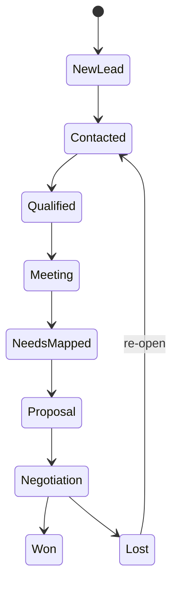

# Domain model

The CRM is a salesperson's daily workspace. Each concept should help answer who to contact, why, what happened, what happens next, and what the opportunity is worth.

## Core concepts

- **Organization**: the workspace boundary for tenant isolation.
- **Owner**: a profile representing a salesperson or administrator.
- **Customer**: a company being prospected, served, or retained.
- **Contact**: a person associated with a customer.
- **Lead**: an unconverted sales signal that may become a customer relationship.
- **Opportunity**: a potential commercial deal with value, probability, stage, and expected close date.
- **Pipeline stage**: the controlled state of an opportunity from new lead through won or lost.
- **Activity**: a planned or completed call, email, meeting, follow-up, task, or note.
- **Sale**: in V1, a won opportunity. A future order model will build on this history.

## Lifecycles

A lead follows `New -> Contacted -> Qualified -> Converted` or `Lost`. Conversion creates or links a customer and contact, then may create an opportunity. Conversion must be idempotent and must not create duplicate companies silently.

## Opportunity value

Weighted value is `value * probability / 100`. Pipeline totals exclude won and lost stages unless a report explicitly asks for historical totals. Won opportunities retain their original value and `won_at` for sales reporting.

## Activity behavior

Open activities can be due today, upcoming, or overdue. Completing an activity sets `completed_at` and `status = completed`; it does not delete the activity, so customer timelines remain auditable. Every activity must belong to a customer or opportunity.

## Future commercial concepts

Products will need a product model plus variant records for size, color, and other workwear attributes. Quotes should have immutable line snapshots for price and VAT calculations, then convert to orders without changing historical quote values.
